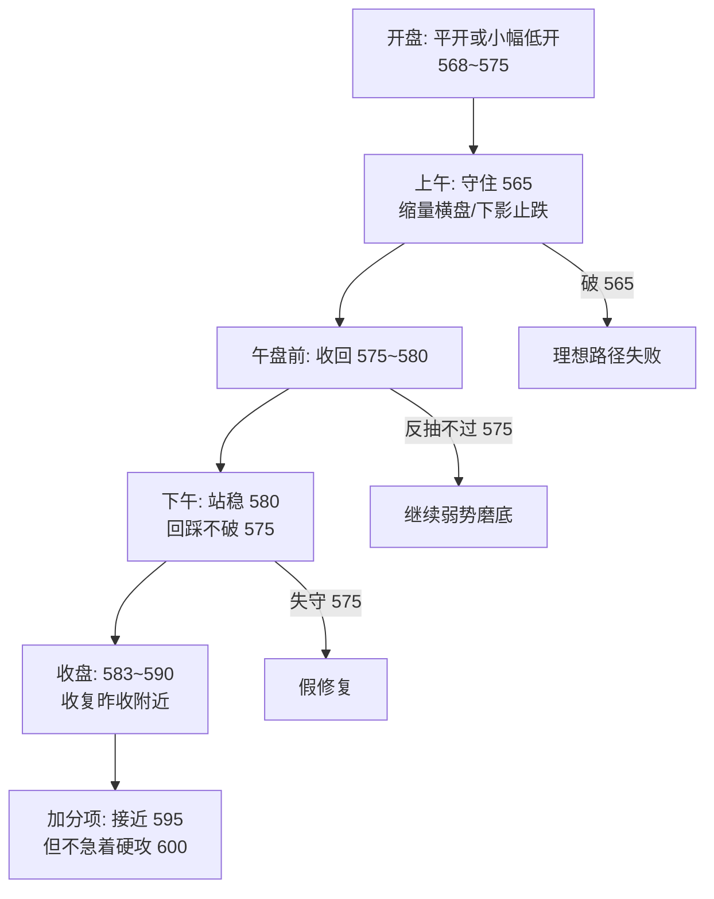

# 兆易创新（603986）Journal

> 周期：15 分钟 · 数据源：东方财富（前复权）  
> 创建：2026-07-14 · 最后更新：2026-07-15（7/16 理想走势）

---

## 背景速览

| 日期 | 收盘 | 涨跌幅 | 备注 |
|------|------|--------|------|
| 07-08 | 603.17 | -2.71% | — |
| 07-09 | 663.49 | +10.00% | 涨停 |
| 07-10 | 612.00 | -7.76% | 高位回落 |
| 07-13 | 550.80 | -10.00% | **跌停** |
| 07-14 | 583.99 | +6.03% | V 型反弹日 |
| **07-15** | **571.79** | **-2.09%** | 高开 600，收阴（见收盘复盘） |

---

## 关键价位

| 级别 | 价位 | 含义 |
|------|------|------|
| 终极支撑 | 534~537 | 7/14 日内低点，反转结构底线 |
| 反转启动区 | 548~553 | 11:30 反转棒 + 13:15 突破位 |
| 短线多空分界 | 565~575 | 理想回踩区 / 第一支撑带 |
| 7/14 收盘 | 583.99 | 基准价 |
| 日内高点 | 587.20 | 第一压力 |
| 心理关口 | 590 | 整数阻力 |
| 强阻力带 | 600~612 | 7/10~7/13 下跌区，大量套牢盘 |
| 更大阻力 | 630~663 | 7/8~7/9 平台区 |

---

## 2026-07-14 · 15 分钟分析摘要

**日内结构**：上午探底（低 534.58）→ 11:30 反转棒 → 13:15 放量突破（+14.9，量占全天 11.5%）→ 午后主升至 587.20 → 尾盘收 583.99。

**上午**：534.58 ~ 572.04，收 548.00，偏空。  
**下午**：553.10 ~ 587.20，收 583.99，多头占优。

**技术指标（50 棒窗口，K1 收盘时）**：

| 指标 | 数值 |
|------|------|
| EMA20 | 571.16 |
| 收盘 vs EMA20 | +12.83（+2.25%） |
| EMA20 五棒斜率 | +4.11（上行） |
| ATR14 | 10.37 |

**结构判断**：大跌后反弹 / 修复段，非新趋势确立。13:15 放量阳棒质量较高；587 一带遇阻。收盘在 EMA20 上方，短线偏强。

---

## 理想反转路径（阶段）

| 阶段 | 内容 | 状态 |
|------|------|------|
| 0 | 抛售高潮（7/13 跌停 + 7/14 探低 534） | ✅ 基本完成 |
| 1 | 反转确认（11:30 反转棒 + 13:15 放量突破） | ✅ 7/14 完成；7/15 未加固 |
| 2 | 健康回踩（575~565 不破，缩量） | ⚠️ 7/15 被动下探 **565.29**，质地偏差 |
| 3 | 突破日内高点（站稳 590~600） | ❌ 7/15 开盘即失败，600 变强压 |
| 4 | 收复前高（突破 612 → 630） | ❌ 远端 |
| 5 | 趋势延续（HL+HH 通道上行） | ❌ 未启动 |

**路径失败条件**：跌破 548 → 二次探底，反转叙事破坏。

---

## 2026-07-15 · 高开情景判断表

> 基准：7/14 收盘 **583.99**，日内高点 **587.20**

### 表 1：按开盘档位

| 开盘档位 | 价位区间 | 偏多信号 | 偏空信号 | 解读 |
|----------|----------|----------|----------|------|
| 小幅高开 | 585~589 | 09:45 收阳；回踩 583~585 缩量止跌；突破 587 向 590 | 15 分钟内跌回 583 下；09:45 收阴放量；上午低点下移 | 最常见，需观察；认可反弹但未确认突破 |
| 中度高开 | 590~598 | 高开后横盘不急跌；回踩 587~590 不破；下午创新高 | 冲高 600 后放量回落；15 分钟连阴；收盘跌回 587 下 | 偏强但防高开低走；跳空给套牢盘出货窗口 |
| 大幅高开 | 600+ | 高开后缩量整理；全天守 595 上；收盘近高位 | 长上影；放量阴棒；收盘回到 590 或 583 下 | 情绪过热；强但交易难度最高 |

### 表 2：按盘中结果

| 明日走势 | 判断 | 后续预期 |
|----------|------|----------|
| 高开 + 09:45 收阳 + 不破 583 | **偏强** | 反转延续，测试 590 |
| 高开 + 横盘 585~590 + 缩量 | **中性偏多** | 以时间换空间，仍可看多 |
| 高开 + 快速跌破 583 | **偏弱** | 高开出货，谨慎 |
| 高开 + 冲 600 后收长上影 | **警惕** | 情绪顶，不宜追 |
| 高开 + 收在 590 上方 | **明显转强** | 短线结构升级，上看 600~612 |

### 表 3：15 分钟盘中观察清单

| 时段 | 观察项 | 偏多 | 偏空 |
|------|--------|------|------|
| 09:30~09:45 | 第一根 15m K | 收在开盘价上；阳棒；量适中 | 收阴；跌破开盘；异常放量下杀 |
| 09:45~10:30 | 缺口与回踩 | 未回补缺口；低点 > 580 | 回补缺口；跌破 583 |
| 10:30~11:30 | 上午结构 | 横盘蓄势或创新高 | 上午高点后持续走低 |
| 13:00~15:00 | 午后延续 | 创新高；守稳上午低点 | 上午高点成全天顶；放量下滑 |

### 表 4：关键支撑 / 阻力应对

| 价位 | 角色 | 高开日应对 |
|------|------|------------|
| 583 | 昨收 / 缺口下沿 | 跌破则高开叙事转弱 |
| 575~580 | 第一回踩区 | 缩量守住 = 健康 |
| 587~590 | 7/14 高点 + 整数关 | 放量突破并站稳 = 转强 |
| 600~612 | 强阻力 / 套牢区 | 首次触碰易回落，需二次确认 |
| 548 | 反转底线 | 有效跌破 = 路径失败 |

---

## 2026-07-15 · 低开情景判断表

> 基准：7/14 收盘 **583.99**，理想回踩区 **565~575**，反转底线 **548~553**

### 表 1：按开盘档位

| 开盘档位 | 价位区间 | 偏多信号 | 偏空信号 | 解读 |
|----------|----------|----------|----------|------|
| 小幅低开 | 578~583 | 09:45 收阳或长下影；低开低走但量缩；在 575 上方止跌 | 09:45 放量阴棒；低开后再破 575；上午低点持续下移 | **最理想回踩形态**；接近日内「涨后缩量回踩」预期 |
| 中度低开 | 570~578 | 低开后快速收复 575；10:30 前回到 580 上；回落量小于 7/14 13:15 上攻量 | 低开后横盘于 570 下；反弹无量；午后仍守不住 575 | 回踩偏深但可接受；关键看 565~575 能否守住 |
| 大幅低开 | 560~570 | 低开后在 565 附近缩量横盘；出现明确反转棒；下午收复 575 | 低开后继续放量下杀；跌破 553；全天无像样反弹 | 测试 EMA20 / 13:15 突破位；结构未破但信心受挫 |
| 极端低开 | <560（逼近 548） | 09:45 即现长下影 + 放量阳收；快速收复 565 | 低开后直奔 548 下；无反弹；跌停或近跌停 | **反转叙事受质疑**；接近 7/14 上午低点区，二次探底风险 |

### 表 2：按盘中结果

| 明日走势 | 判断 | 后续预期 |
|----------|------|----------|
| 低开 + 09:45 收阳 + 守 575 | **健康回踩** | 理想反转路径延续，后续攻 587~590 |
| 低开 + 575~580 横盘 + 缩量 | **中性偏多** | 以时间换空间，结构仍完整 |
| 低开 + 下探 565 后拉回 580+ | **偏强洗盘** | 完成 HL 确认，反转质量提升 |
| 低开 + 跌破 575 收 570 下 | **偏弱** | 7/14 反弹成色不足，重回震荡 |
| 低开 + 跌破 553 | **路径失败** | 二次探底，看 534~537 能否再守 |
| 低开 + 午后收红（阳包阴） | **明显转强** | 洗盘成功，短线可再看 587~590 |

### 表 3：15 分钟盘中观察清单

| 时段 | 观察项 | 偏多 | 偏空 |
|------|--------|------|------|
| 09:30~09:45 | 第一根 15m K | 长下影后收高；阳棒；量小于 7/14 09:45 | 大阴棒；量放大；开盘即最低 |
| 09:45~10:30 | 回踩深度 | 低点 ≥575 或 565 有止跌；量逐步萎缩 | 跌破 575 且量增；反弹无力 |
| 10:30~11:30 | 上午结构 | 形成 HL（高于 534）；向 580 修复 | 低点低于 565；反弹高点递减 |
| 13:00~15:00 | 午后延续 | 收复 580；挑战 583~587 | 上午低点被破；收在 570 下 |

### 表 4：关键支撑 / 阻力应对

| 价位 | 角色 | 低开日应对 |
|------|------|------------|
| 583 | 昨收 / 缺口上沿 | 低开后能收回 = 洗盘成功 |
| 575~580 | 理想回踩区 | 缩量守住 = 健康，对应理想路径阶段 2 |
| 565~570 | EMA20 / 深度回踩 | 守住 = 结构仍完整；跌破需警惕 |
| 553 | 13:15 突破位 | 有效跌破 = 7/14 突破作废 |
| 548 | 反转启动区 | 有效跌破 = 路径失败 |
| 534~537 | 终极支撑 | 再破 = 新低，反转叙事终结 |

### 表 5：低开 vs 理想反转路径对照

| 低开幅度 | 对应路径阶段 | 结构评价 | 交易含义 |
|----------|--------------|----------|----------|
| 578~583（小幅） | 阶段 2 正常回踩 | ⭐⭐⭐ 最理想 | 涨后缩量回踩，等 575 止跌确认 |
| 570~578（中度） | 阶段 2 偏深回踩 | ⭐⭐ 可接受 | 不追杀，等 565~575 企稳 |
| 560~570（大幅） | 阶段 2 极限测试 | ⭐ 临界 | 仅结构未破时可观察，不宜盲目抄底 |
| <560（极端） | 路径失败边缘 | ❌ 危险 | 按二次探底处理，等 534 区域信号 |

---

## 2026-07-15 · 集合竞价实况

> 拉取时间：约 09:27（CN）· 数据源：东方财富 `details` 竞价撮合序列 + `stock/get`  
> 昨收：**583.99** · 开盘/**撮合价**：**600.00** · 涨跌：**+16.01（+2.74%）**

### 竞价撮合结果

| 项目 | 数值 | 备注 |
|------|------|------|
| 昨收 | 583.99 | 7/14 收盘 |
| 开盘价 / 09:25 撮合 | **600.00** | 正式开盘价 |
| 跳空幅度 | +16.01（+2.74%） | 相对昨收 |
| 涨停 / 跌停 | 642.39 / 525.59 | 10% 板 |
| 竞价成交量 | **9359 手**（约 93.59 万股） | 09:25:02 最终量 |
| 竞价成交额 | **约 5.62 亿元** | `amount≈56154万` |
| 量比（开盘时） | **3.31** | 热度偏高 |
| 开盘盘口 | 卖一 600.00×492 手；买一 599.98×1 手 | 卖压挂在开盘价附近 |

### 竞价路径（虚拟撮合参考价）

| 时段 | 参考价轨迹 | 累计可撮合量（手） | 含义 |
|------|------------|-------------------|------|
| 09:15:02 | **640.00**（近涨停） | 100 | 情绪极端、试探上沿 |
| 09:15:05~17 | 610 → 625 → **614~615** | 276 → 1212 | 快速回吐，中枢下移 |
| 09:15:30~09:22 | **~614.8** 横盘 | 1400 → 3050+ | 竞价前半偏稳，量稳步堆积 |
| 09:22:53~09:24:20 | 612 → **608** | 3390 → 4974 | 开始缓跌，卖压加大 |
| 09:24:23~09:24:53 | 607 → **600** | 5010 → 7471 | **最后一分钟跳水** |
| 09:24:53~09:25:02 | **600 敲定** | 7471 → **9359** | 尾段放量砸实开盘价 |

**竞价一句话**：早盘先冲近涨停（640），再砸回整数关 **600** 开盘；属于**情绪高开 → 竞价回落定锚**，不是缩量温吞高开。

### 对表：落入哪一档情景？

| 预设情景表 | 是否命中 | 说明 |
|------------|----------|------|
| 低开各档 | ❌ | 开盘 600 > 昨收 583.99，低开表不适用 |
| 高开 · 小幅（585~589） | ❌ | 跳空远大于此档 |
| 高开 · 中度（590~598） | ❌（差一点） | 终价高于 598 |
| **高开 · 大幅（600+）** | ✅ **命中** | 恰好踩在 **600** 门槛，进入 7/10~7/13 套牢带 |

### 对照「大幅高开」预案（原表 1）

| 维度 | 预案要求 | 竞价给出的初判 |
|------|----------|----------------|
| 偏多路径 | 高开后缩量整理；全天守 **595** 上；收盘近高位 | **待验证**：竞价量已不小（9359 手），开盘后需看是否缩量横盘 |
| 偏空路径 | 长上影；放量阴棒；收盘回到 **590 / 583** 下 | **风险已抬头**：竞价路径 640→600 本身就是一组长下杀，卖压真实存在 |
| 交易难度 | 情绪过热，难度最高 | **成立**：直接开在 600 强阻力带 |

### 对照高开「盘中结果表」（原表 2）——开盘后盯什么

| 若开盘后出现… | 原表判断 | 今日具体阈值 |
|---------------|----------|--------------|
| 09:45 收阳 + 不破昨收缺口下沿 | 偏强 | 不破 **583**（更严：最好不破 **595**） |
| 横盘 + 缩量 | 中性偏多 | 横在 **595~605**，量比回落 |
| 快速跌破昨收 | 偏弱 / 高开出货 | 跌破 **583** |
| 冲高后长上影 | 警惕情绪顶 | 冲 **612~630** 后回落收 600 下 |
| 收在 590 上方 | 短线转强 | 对今日而言门槛偏低；**应收在 595~600 上方**才配得上大幅高开 |

### 对照关键价位（高开表 4 + 低开无关）

| 价位 | 今日角色 | 操作含义 |
|------|----------|----------|
| **600** | 开盘锚 / 套牢首关 | 守住并收回 = 承接有效；反复失守 = 高开诱多 |
| **595** | 大幅高开底线 | 预案「全天守 595」；失守后看 590 |
| **590** | 中度高开档上沿 | 失守 = 高开叙事明显转弱 |
| **583.99** | 昨收 / 缺口下沿 | 回补缺口；跌破 = 高开出货确认 |
| **612** | 7/10 前收一带 | 首次上冲易遇阻，需放量站稳才升级 |
| **642.39** | 涨停 | 竞价曾摸到 640，但未成交于该价；追板风险极高 |

### 与「理想反转路径」的关系

| 理想阶段 | 本应出现 | 竞价实际 |
|----------|----------|----------|
| 阶段 2 健康回踩 | 缩量回踩 **565~575** | **没给**：直接跳到 600，**跳过回踩** |
| 阶段 3 突破 590~600 | 回踩后再攻 | **竞价一脚踩进阶段 3 阻力区** |
| 结构完整性 | 先有 HL，再突破 | 今日变成「强势但缺回踩确认」路径 |

**含义**：若走强，节奏会更快（直接考验 600~612）；若走弱，更容易演变成「高开低走 → 补缺口」，把昨天的理想缩量回踩推迟到今天盘中完成。

### 开盘后 15 分钟观察清单（针对本档）

| 时段 | 优先观察 | 偏多 | 偏空 |
|------|----------|------|------|
| 09:30~09:45 | 第一根 15m | 收 ≥600 或长下影收回 600；量不过度放大 | 大阴破 **595**；开盘即最高 |
| 09:45~10:30 | 缺口与套牢带 | 横盘 595~605；量比回落 | 放量砸破 590 |
| 10:30~11:30 | 是否升级 | 放量站上 **605~612** | 反弹高点降低，低点向 583 倾斜 |
| 午后 | 收盘质量 | 收在开盘价上方或接近高位 | 收长上影或收 590 下 |

### 实战结论（竞价后即时）

1. **情景定性**：7/15 = **大幅高开（600）**，不是低开、也不是理想缩量回踩。  
2. **优先剧本**：按原「大幅高开」预案执行 —— **先验证 595/600，不追竞价情绪**。  
3. **最佳多头证实**：09:45 前后守住 595~600，量能降温后再度上攻 605+。  
4. **最差空头证实**：开盘后放量跌破 595→590，甚至回补至 583 —— 按「高开出货」处理。  
5. **低开表**：今日开盘不适用；若日内深回 575 以下，再借用低开表的支撑逻辑做盘中回踩判读。

---

## 2026-07-15 · 1 分钟 K 线分析（开盘后约 8 分钟）

> 拉取时间：约 **09:37**（CN）· 数据：东方财富 1 分钟 / 分时  
> 现价约 **594** · 开盘 **600** · 最高 **608.07** · 最低 **590.00** · 较昨收约 **+1.7%**  
> 成交量约 **11.3 万手** · 成交额约 **68 亿** · 量比约 **5.0**

### 1 分钟逐棒

| 时间 | 方向 | O / H / L / C | 量(手) | 结构标签 |
|------|------|---------------|--------|----------|
| 09:30 | 十字 | 600 / 600 / 600 / 600 | 9359 | 竞价定锚，开在 600 |
| 09:31 | 阳 | 599 / 605 / **595.67** / 604.20 | **23248** | 测 595 后强拉，量大 |
| 09:32 | 阳 | 603.60 / 604 / 600.01 / 604.00 | 18694 | 守住 600，续强 |
| 09:33 | 阴 | 605.06 / **608.07** / 603 / 604.99 | 14116 | **日内高点**，上影承压 |
| 09:34 | 阴 | 604.90 / 604.90 / **593.36** / 598 | 14750 | **失守开盘价**，砸破 595 |
| 09:35 | 阳 | 599.23 / 600.68 / 598.01 / 599.84 | 10180 | 弱反弹，未稳站 600 |
| 09:36 | 阴 | 599 / 599 / 591.84 / **592** | 6749 | 再次跌破 595 |
| 09:37 | 阳 | 591.22 / 597.91 / **590.00** / 595 | 14328 | **触及 590** 后拉回 595 |
| 09:38 | 阴(形成中) | ~596 → ~594 | — | 仍在 595 附近纠缠 |

### 盘面五阶段

| 阶段 | 时段 | 走势 | 含义 |
|------|------|------|------|
| P1 定锚 | 09:30 | 600 平开 | 竞价结果落地 |
| P2 冲高 | 09:31~09:33 | 595.67 → **608.07** | 尝试消化套牢带，冲高失败前兆 |
| P3 拒绝 | 09:34 | 604 → 593 / 收 598 | **大幅高开偏空信号启动**：开盘价失守 |
| P4 下探 | 09:35~09:37 | 下探 **590** | 触及「叙事转弱线」 |
| P5 反抽 | 09:37~09:38 | 590 → 595~596 | 在 590 有买盘，但尚未收复 600 |

### 对照「大幅高开」预案 —— 当前判定

| 预案路径 | 条件 | 09:37 状态 |
|----------|------|------------|
| 偏多 | 守 595~600，缩量后再攻 605+ | ❌ **未满足**：已失守 600，并两次跌破 595 |
| 偏空 / 高开出货 | 放量破 595→590，甚至回补 583 | ⚠️ **部分命中**：已破 595、触及 590；尚未到 583 |
| 警惕长上影 | 冲高回落 | ✅ **已出现**：高 608.07 → 现价 ~594，上影约 14 元 |

**即时定性**：**大幅高开后的冲高回落 / 高开低走雏形**。  
竞价里 640→600 的抛压，在连续竞价中延续为 608→590。

### 关键价位（1 分钟视角）

| 价位 | 角色 | 开盘后表现 |
|------|------|------------|
| 608.07 | 早盘高点 | 09:33 冲高被拒，短线压力 |
| 600 | 开盘锚 | **已失守**（09:34）；收复前难言转强 |
| 595 | 大幅高开底线 | 09:31/09:34/09:37 反复测试，当前在附近纠缠 |
| **590** | 叙事转弱线 | **已触及**（09:37）；若放量跌破并站不住，加强出货判断 |
| 583.99 | 昨收 / 缺口 | 尚未触及；若跌到此处 = 高开出货确认 |
| 575 | 理想回踩区 | 更深一级；若到此可借低开表逻辑做「盘中回踩」评估 |

### 量能解读

- 前 8 分钟成交额已约 **68 亿**，量比 ~5，**换手激烈**
- 最强买盘出现在 09:31（测 595 后拉）
- 最强卖压出现在 09:34（破开盘）与 09:37（摸 590）
- 目前不是「缩量整理后再上攻」，更像「放量争夺后多头撤退」

### 开盘后路径切换

| 接下来 15~30 分钟 | 判断 | 动作含义 |
|-------------------|------|----------|
| 收回并站稳 **600**，再过 608 | 假跌破 / 洗盘 | 大幅高开叙事可修复 |
| 横盘 **590~600**，量比下降 | 高开后消化 | 中性；等方向选择 |
| **放量跌破 590** | 高开出货强化 | 看 583 缺口回补 |
| 跌破 583 | 路径转弱确认 | 借用低开/回踩表，看 575~565 |

### 与理想反转路径

- 阶段 2（缩量回踩）仍未完成；今日若继续回落，**可能把健康回踩推迟到盘中甚至更低位置完成**
- 阶段 3（站稳 600）**开盘尝试失败**，需重新攻克
- 若守住 590 上方并重新收复 600，仍可视为「强势震荡」而非趋势破坏
- 若放量跌破 590→583，则更接近「一日游式高开」，7/14 反转仍在，但 7/15 强度不够

### 1 分钟结论（截止 09:37）

1. **不是理想缩量回踩，也不是顺畅突破**，而是**高开冲高后回落**。  
2. 预案命中：**大幅高开偏空分支开始兑现**（失守 600、触及 590）。  
3. 多头最后防线短期看 **590**；夺回主动权必须 **收复 600**。  
4. 在收复 600 之前，不按「突破追涨」处理；优先观察 590 守不守得住。

---

## 2026-07-15 · 洗盘还是出货？（约 09:39）

> 现价约 **593~594** · 高 **608.07** · 低 **589.02** · 开盘 **600** · 量比 ~4.9 · 成交额约 **75 亿**

### 结论先说

**当前更像「出货 / 高位派发」占优，不是标准洗盘。**  
更准确：早盘是**强阻力带（600~612）遇到真实供给**；洗盘证据不足，但若 **589~590 缩量守住并快速收复 600**，可上修为洗盘。

### 对比清单

| 特征 | 洗盘通常长这样 | 出货通常长这样 | 今日早盘 |
|------|----------------|----------------|----------|
| 回落位置 | 回踩支撑（575~583） | 在阻力区（600~612）回头 | ✅ 开在阻力区就回头 |
| 量能 | 回落缩量 | 冲高或回落放量 | ✅ 量比~5，额已约 75 亿 |
| 开盘价 | 失守后很快收回 | 失守后反弹变弱 | ✅ 09:34 失守 600，反弹未站稳 |
| 高低点 | 低点抬高（HL） | 高点降低 + 低点下移 | ✅ 高点 608→600→597；低点 595→593→590→**589** |
| 上影 | 少见或很快消化 | 明显长上影 | ✅ 高 608 → 现价 ~593 |
| 反弹质量 | 阳线放量收回关键位 | 反弹中卖盘打进 | ✅ 09:38 从 590 反抽时逐笔偏「卖」抬升 |
| 与昨收关系 | 远离危险区 | 可能回补缺口 | ⚠️ 仍高于 583，尚未确认出货完成 |

### 支持「出货」的硬证据

1. **位置不对**：洗盘应发生在支撑区；这里是跳空进入 **600~612 套牢带** 后回落。  
2. **结构走坏**：失守开盘 600 → 破 595 → 摸 590 → 再低 **589.02**，低点下移。  
3. **冲高被拒**：09:33 摸 608.07 后大阴，属于阻力区供给释放。  
4. **反弹越来越弱**：09:35 反抽近 600 失败；09:37~39 只反到 594 一带。  
5. **竞价已预告抛压**：640→600，连续竞价延续为 608→589。

### 尚不能一锤定音「出货完成」的理由

1. 价格仍在昨收 **583.99** 上方（约 +1.7%），缺口未回补。  
2. 在 **590/589** 仍有买盘接（09:37、09:39 阳线）。  
3. 若接下来 **缩量** 横住 589~595，并在上午收复 600，则可改判「深洗后修复」。

### 判定规则（接下来怎么改口）

| 观察 | 改判方向 |
|------|----------|
| 缩量守 **589~590**，30 分钟内收回 **600** | 上修为 **洗盘成功** |
| 放量跌破 **589**，尤其向 **583** 推进 | 坐实 **出货 / 高开低走** |
| 横盘 590~600 半天，量比回落 | **中性消化**，方向未定 |
| 再次冲 608 放量不过 | 继续按 **派发**，不追高 |

### 一句话

**现在按出货思路风控，不按洗盘思路抄底。**  
洗盘的证明责任在多头：必须把 **600** 夺回来；否则 608→589 就是阻力区派发。

---

## 2026-07-15 · 继续跟进（约 09:46）

> 现价约 **595.6** · 开盘 **600** · 最高仍 **608.07** · **新低 580.22** · 较昨收约 **+2.0%** · 量比 ~4.0 · 成交额约 **106 亿**

### 本轮新变化（相对 09:39）

| 事件 | 时间 | 含义 |
|------|------|------|
| 跌破 589 | 09:40~09:41 | 此前「守 589」防线失守 |
| 刺破昨收缺口 | 09:41~09:43 低至 **580.22** | 高开出货路径 **部分兑现**（缺口被砸穿） |
| 快速反抽 | 09:44~09:46：580 → **595.6** | 缺口下方出现承接，不是单边砸死 |
| 仍未收复 600 | 全程 | 多头尚未夺回主动权 |

### 1 分钟分段

| 时段 | 区间 | 量能特征 | 结构 |
|------|------|----------|------|
| 09:30~09:39 | 608 → 589 | 约 12.7 万手，冲高回落 | 出货主导 |
| 09:40~09:43 | 589 → **580.22** | 继续放量下探 | 破位、回补缺口 |
| 09:44~09:46 | 580 → **595.6** | 反抽，后两根量递减 | 缺口区有买盘 |

### 洗盘 vs 出货 —— 更新判定

| 原规则 | 实际 | 判定变化 |
|--------|------|----------|
| 放量跌破 589 → 坐实出货 | ✅ 已发生，并打到 580 | **出货分支兑现一截** |
| 砸向 583 | ✅ 已刺穿至 580.22 | 缺口回补完成（价格曾低于昨收） |
| 缩量守 589 并收回 600 → 洗盘 | ❌ 589 没守住；600 未收复 | 经典洗盘仍不成立 |
| 缺口下有承接后拉回 | ✅ 09:44~46 出现 | **增加「假跌破 / 深洗」候选** |

**当前综合判断（09:46）：**

> **出货打到缺口后，转入“深回踩 + 反抽争夺”**。  
> 比 09:39 更弱（破了 589/583），但又不是单边崩溃（580 快速拉回 595）。  
> **定性：偏出货后的修复反抽，尚未升级为洗盘成功。**

### 第一根 15 分钟 K（09:30~09:45）草图

| 项目 | 数值 |
|------|------|
| 开 | 600 |
| 高 | 608.07 |
| 低 | 580.22 |
| 收 | 约 593~596 |
| 形态 | 大振幅长下影，上有 608 拒绝、下有 580 承接 |

### 下一观察窗口（09:45~10:15）

| 走势 | 新判定 |
|------|--------|
| 继续上行，收复并站稳 **600**，最好过 605 | 上修为 **深洗成功** |
| 卡在 **595~600** 缩量横盘 | **修复中**，方向未定 |
| 反抽失败，再次跌破 **585** 并压向 580 | **出货续跌**，看 575 |
| 放量跌破 **580** | 二次探底风险，借低开表看 575~565 |

### 关键位更新

| 价位 | 最新角色 |
|------|----------|
| 608 | 早盘供给高点 |
| 600 | 夺回主动权线（仍未收复） |
| 595 | 当前反抽枢纽 |
| 589~590 | 已破，变为上方压力/回踩参考 |
| **583.99** | 昨收，已被刺穿 |
| **580.22** | 早盘新低 / 缺口下沿承接 |
| 575 | 下一档支撑（理想回踩区上沿） |

### 跟进一句话

**破 589 后砸到 580，出货坐实一波；但 580 有承接并拉回 595，进入修复观察。**  
现在既不追高，也不盲目在缺口下抢反弹——等 **600 收复** 或 **580 再破** 二选一。

---

## 2026-07-15 · 继续跟进 #2（约 09:52）

> 现价约 **599.9** · 开盘 **600** · 最高仍 **608.07** · 最低仍 **580.22** · 较昨收约 **+2.7%** · 量比回落至 ~**3.3** · 成交额约 **123 亿**

### 相对 09:46 的新变化

| 事件 | 时间 | 含义 |
|------|------|------|
| 连续反抽抬高 | 09:44~09:49 | 580 → 590 → 597 → **602.50** |
| **短暂收复 600** | 09:48~09:49 | 收盘 600.69 / 601.89，高点 **602.50** |
| 未能稳站 | 09:50~09:52 | 回落到 597~600，现价贴着开盘价纠缠 |
| 580 未再破 | 全程 | 出货续跌分支**暂未**走出来 |
| 量比下降 | 5.0 → 3.3 | 脉冲降温，利于「修复」解读 |

### 1 分钟关键棒（反抽段）

| 时间 | O/H/L/C | 标签 |
|------|---------|------|
| 09:46 | 592.9 / 597.5 / 591.7 / 597.5 | 突破 595 |
| 09:47 | 598 / **600** / 598 / 599.2 | 触及开盘价 |
| 09:48 | 599 / 601.4 / 598.6 / **600.7** | 收复 600 |
| 09:49 | 600.4 / **602.5** / 598.8 / **601.9** | 反抽高点 |
| 09:50 | 601.5 / 601.5 / 597 / 598.8 | 回落失稳 |
| 09:51 | 600.4 / 602 / 597 / 597.4 | 再测后走弱 |
| 09:52 | 596.8 / 600 / 596.6 / **599.9** | 贴 600 争夺 |

### 15 分钟对照

| K 线 | OHLC | 读法 |
|------|------|------|
| 09:30 | 600 / 608.07 / **580.22** / ~590 | 高开深砸长下影 |
| 09:45 | ~591 / **602.50** / 591 / ~**600** | **修复阳**，回补大半跌幅，挑战开盘价 |

### 洗盘 vs 出货 —— 再更新

| 二选一规则 | 状态 | 含义 |
|------------|------|------|
| 收复并站稳 600 | ⚠️ **摸到并短暂站上，尚未站稳** | 深洗候选**加强**，未确认成功 |
| 580 再破 | ❌ 未发生 | 出货续跌暂缓 |
| 卡在 595~600 | ✅ 正在发生 | 主战场变成开盘价拉锯 |

**综合判定（09:52）：**

> 从「出货后修复反抽」上修半级为 **「深洗争夺中」**。  
> 多头已完成：守 580、收复 590/595、考验 600。  
> 多头未完成：**有效站稳 600**（最好连续数分钟或下一根 15m 收在 600 上）。  
> 空头若要翻盘：需要在 600 附近再次拒绝，并跌破 **595** 后压向 585/580。

### 盘口观察

- 卖一附近挂单较厚（约 600×99 手量级），说明开盘价仍有供给。  
- 近 5 分钟买卖逐笔大致均衡，买量略多，不是单边砸盘。

### 下一观察窗口（至 10:15）

| 走势 | 新判定 |
|------|--------|
| 10:00 前稳住 **600** 上，回踩不破 595 | **深洗成功**倾向 |
| 反复触 600~602 不过，阴线压回 595 下 | **假收回**，出货压力仍在 |
| 放量过 **605** 并远离 600 | 短线转强，回看 608 |
| 跌破 **595** 后滑向 585 | 修复失败，回到偏空 |

### 跟进一句话

**580 承接有效，反抽已打到 600~602；现在就看开盘价能不能从“争夺”变成“支撑”。**  
站稳 600 = 洗盘叙事占优；再次掉下 595 = 仍是出货反抽。

---

## 2026-07-15 · 有无加仓点？（约 09:54）

> 评估时现价约 **592**（刚从 600~602 回落）· 高 608.07 · 低 580.22 · 量比 ~3.0

### 先说结论

| 问题 | 答案 |
|------|------|
| **现在（~592）能不能加？** | **不加**。600 假收回后回落，属于修复失败边缘，不是加仓触发。 |
| **有没有合格加仓点？** | **有，但是条件单，不是追价。** 分「已有底仓」和「空仓」两套。 |
| **空仓追今天高开？** | **不建议。** 今日主结构仍是高开深砸再反抽，确认度不够。 |

### 为什么现价不是加仓点

1. 09:48~49 收复 600 后，09:50~54 **掉回 592** → 更像假收回。  
2. 加仓应加在「确认后的回踩」或「关键位止跌」，不是加在失守过程中。  
3. 若在 600 附近加，现在浮亏，且下方 595 已失，止损难设。

### 若已有底仓（认 7/14 反转逻辑）——条件加仓表

| 优先级 | 加仓区 | 触发条件 | 失效 / 止损参考 | 性质 |
|--------|--------|----------|-----------------|------|
| **A 最优** | **595~598** 回踩 | 先重新站稳 **600** 至少 5~10 分钟（或 15m 收盘 >600），再缩量回踩不破 595 | 跌破 **589~590** | 深洗确认后的加仓 |
| **B 次优** | **580~583** | 再次回踩昨收/早盘低点区，**1m 止跌 + 缩量**，不破 580 或破后马上收回 | 收盘站不上 580 / 放量破 **575** | 缺口支撑加仓（博深洗） |
| **C 激进** | **575~578** | 打到理想回踩区上沿，出现明确下影止跌 | 破 **565** 或放量破 575 不收回 | 对接原「理想回踩」；仓位要更小 |
| **D 不该加** | 600~608 追高 | — | — | 阻力区追价 |
| **D 不该加** | 592 附近被动补仓 | — | — | 当前正处回落中 |

### 若空仓——更严

| 动作 | 条件 |
|------|------|
| 首次试仓 | 仅考虑 **A**：先看到 600 站稳，再在 595~598 回踩试仓 |
| 或更稳 | 等 **15m 连续两根** 收在 595 上且结构 HL，再谈 |
| 今日不做 | 价格在 595 下阴跌、或再破 580 放量时 |

### 加仓与「洗盘/出货」绑定

```
站稳 600 → 回踩 595 不破  → 允许加仓（A）
掉下 595 → 只准等 580/575 → 才考虑加（B/C），且仓位降档
破 575 放量 → 停止加仓，按反转失败处理
```

### 风险提示（硬约束）

- 今日振幅已极大（608→580），**加仓单笔风险要显著小于常仓**。  
- 600 未被站稳前，任何加仓都是「抢修复」，不是「顺趋势加仓」。  
- 计划止损必须先于加仓价位想清楚；否则宁愿不加。

### 针对此刻（~592）的执行句

**不加。**  
下一步只做观察：  
- 再上 **600 并站稳** → 等回踩 595 做 A 类加仓；  
- 下行去 **580~583 止跌** → 才评估 B 类；  
- 破 **575** → 今日不做加仓。

---

## 2026-07-15 · 继续跟进 #3（约 10:48）

> 现价约 **588** · 开盘 **600** · 最高仍 **608.07** · 最低仍 **580.22** · 较昨收约 **+0.7%** · 量比回落至 ~**1.5** · 成交额约 **196 亿**

### 相对 09:54 的核心变化

| 事件 | 时间 | 含义 |
|------|------|------|
| 假收回确认 | 09:50~09:56 | 从 ~600 掉到 590 下方 |
| **第二次冲击 600 失败** | 10:30~10:31 高 **602.04**，随后阴跌 | 开盘价供给再次获胜 |
| 回落到 **585~590** | 10:32~10:48 | 卡在「非 A、非 B」中间带 |
| 量能明显降温 | 量比 5→3→**1.5** | 脉冲结束，进入磨盘 |
| 580 / 575 未破 | 全程 | 尚未触发 B/C 加仓，也未趋势崩溃 |

### 15 分钟序列

| 时间 | OHLC | 读法 |
|------|------|------|
| 09:30 | 600 / 608 / **580** / 590 | 高开深砸 |
| 09:45 | 591 / **602.5** / 589 / 592 | 修复后假收回萌芽 |
| 10:00 | 591 / 596 / 585 / 590 | 震荡偏弱 |
| 10:15 | 590 / 598 / 588 / **598** | 再次积蓄上冲 |
| 10:30 | 598 / **602** / **586** / **586** | **第二次拒在 600~602，大阴回落** |
| 10:45 | ~586 / 590 / 585 / ~588 | 低位磨（形成中） |

### 结构一句话

**600 不是支撑，是反复供给区。**  
两次上冲（09:48~49、10:30~31）都以 602 附近结束，随后回到 585~590。  
早盘「深洗成功」叙事**回撤**；更像 **580~602 区间上沿派发、下沿未决**。

### 洗盘 vs 出货 —— #3 判定

| 项目 | 状态 |
|------|------|
| 深洗成功（站稳 600） | ❌ 两次失败 |
| 出货续跌（破 580） | ❌ 尚未 |
| 当前定性 | **高开后的宽幅震荡 / 上沿出货、下沿等待** |
| 相对昨收 | 仍小幅翻红，但优势很薄 |

### 加仓点执行更新

| 计划 | 10:48 状态 | 动作 |
|------|------------|------|
| **A**（600 站稳 → 回踩 595） | ❌ 触发条件不满足 | **继续冻结** |
| **B**（580~583 止跌） | 未到 | 跌到再评估，现价 588 **不预加** |
| **C**（575~578） | 未到 | 更后方 |
| 现价 ~588 补仓 | — | **不加**（区间中部最差位置） |

### 下一观察窗口（11:00 前后 / 午后）

| 走势 | 判定 |
|------|------|
| 第三次冲击，**收盘站稳 600** 上 | 才重新激活 A 路径 |
| 下探 **580~583** 缩量止跌 | 激活 B 评估 |
| 放量破 **580** | 看 575；B 作废改 C 或停加 |
| 继续 585~595 磨 | 观望，等边沿 |

### 跟进一句话

**600 两次假收回，定性转回“上沿供给 + 区间震荡”；现价 588 仍不是加仓点。**  
只等两边：上面真正站住 600，或下面给你 580/575 的边沿价。

---

## 2026-07-15 · 继续跟进 #4（约 11:06）

> 现价约 **580.6** · 开盘 600 · 最高仍 608.07 · **新低 580.01** · 较昨收约 **-0.6%**（翻绿）· 量比 ~**1.3** · 成交额约 **214 亿**

### 相对 10:48 的核心变化

| 事件 | 时间 | 含义 |
|------|------|------|
| 脱离 588 中枢下行 | 10:48~10:54 | 区间中部下踩 |
| 跌破昨收 583.99 | 10:54 起反复 | 日线由红转绿边缘 |
| **进入 B 区 580~583** | 10:54、11:04~06 | 条件加仓观察区触发 |
| 微创新低 **580.01** | 11:06 | 早盘低点 580.22 被刺穿一点 |
| 量能继续萎缩 | 量比 ~1.3 | 下挫未再现早盘脉冲暴量 |

### 15 分钟更新

| 时间 | OHLC | 读法 |
|------|------|------|
| 10:30 | 598 / 602 / 586 / 586 | 二次拒 600 |
| 10:45 | 586 / 590 / **581** / 587 | 下探昨收附近后收回 |
| 11:00 | 587 / 587 / **580.01** / **~580.6** | 压在 B 区下沿（形成中） |

### 结构判定

**区间下沿正在测试。**  
上沿 600 两次失败后，价格花费约 1 小时磨到 **580**；目前是「边沿博弈」，不是中部乱加仓。  
微破 580.22 → 下沿质量变差，**不能无价位盲加**，必须等 1 分钟止跌证据。

### 洗盘 vs 出货

| 项目 | 11:06 状态 |
|------|------------|
| 站稳 600 / 深洗成功 | ❌ |
| 宽幅震荡下沿测试 | ✅ 进行中 |
| 出货破位确认 | ⚠️ 刺穿早盘低，但未放量崩 |
| 日线 | 翻绿，弱势于早盘修复预期 |

### 加仓点执行（此刻最关键）

| 计划 | 状态 | 动作 |
|------|------|------|
| A（600→595） | 仍冻结 | 不动 |
| **B（580~583）** | **价到了** | **仅观察 / 小仓条件单，不追跌** |
| C（575~578） | 待命 | 若放量破 580 不收回 → 切换 |

**B 区允许加仓的最低标准（缺一不可）：**

1. 1 分钟出现**止跌**：长下影或阳收，低点不再下移  
2. **缩量**相对 10:54 / 11:05 那波抛压  
3. 最好收回 **583**（昨收）或至少站回 **581.5** 上  
4. 预设失效：放量落下 **578~575** → 按失败处理，不加或减

**明确禁止：**

- 现价阴跌过程中「以为到了 B 就马上加」  
- 破 580 后继续向 575 自由落体中接飞刀  

### 二选一升级

| 走势（午盘前） | 判定 |
|----------------|------|
| 580 止跌并收回 583~585 | B 类试仓可评估；目标仍看回踩后的 595 |
| 横盘 580~583 缩量 | 等待，也可极小仓试错+严止损 |
| **放量破 580→575** | B 作废，转 C 或今日停加 |
| 又冲回 595/600 | 先当反抽，600 站稳前仍不用 A |

### 跟进一句话

**球到了 B 区下沿：可以开始准备条件单，但仍不是无开就加。**  
先看 1 分钟能不能在 580 止血；止血才谈加，失血就让给 575。

---

## 2026-07-15 · 继续跟进 #5（约 13:31）

> 现价约 **583.3** · 开盘 600 · 最高仍 608.07 · **新低 568.00** · 较昨收约 **-0.1%** · 量比 ~**1.06** · 成交额约 **267 亿**

### 相对 11:06 的核心变化

| 事件 | 时间 | 含义 |
|------|------|------|
| B 区反抽失败 | 11:07~11:14 一度回 585，再下 | 未给出合格 B 止跌加仓 |
| 进入并跌破 C 区 | 11:24~11:29 575~578 | **B 计划作废** |
| 午盘继续下砸 | 13:01~13:15 低至 **568** | 跌破 575，创日新低 |
| **尾盘式反抽** | 13:16~13:31：568 → **583** | 深砸后快速收回昨收附近 |
| 未收回 595/600 | 全程 | A 路径仍冻结 |

### 15 分钟关键棒

| 时间 | OHLC | 读法 |
|------|------|------|
| 11:00 | 587 / 587 / 579.5 / 586 | B 区缠斗 |
| 11:15 | 585 / 587 / **576** / **577.5** | 失守 B，进入 C |
| 13:00 | 579 / 580 / **568.7** / **569.7** | 午盘低开下砸 |
| 13:15 | 570 / **583** / **568** / **583** | **长下影阳**：568 承接后拉回 |
| 13:30 | ~583 / 583 / 582 / ~583 | 昨收附近纠缠（形成中） |

### 结构判定

1. **上午逻辑延续**：600 假收回 → 磨破 580 → 再破 575，偏空兑现。  
2. **午盘出现更深支撑测试**：日低 **568**（低于原 C 区）。  
3. **随后出现合格「深砸反抽」**：13:15 附近从 568 拉回 583，像把跳空后的第三次下探做成了长下影。  
4. 但性质仍是 **修复反抽**，不是趋势反转确认（600/595 仍远）。

### 洗盘 vs 出货 —— #5

| 项目 | 状态 |
|------|------|
| B 区加仓 | ❌ **失效**（放量路径已破 580→575→568） |
| C 区加仓 | ⚠️ 曾进入，但又破 575；严格说也未干净触发 |
| 新观察区 | **568~575** 深支撑反抽 |
| 出货单边 | ❌ 被 13:15 反抽否定（至少盘中） |
| 当前定性 | **深砸后的反抽修复 / 波动率释放后收敛** |

### 加仓点执行更新

| 计划 | 状态 | 动作 |
|------|------|------|
| A（600→595） | 冻结 | 不动 |
| B（580~583） | **作废** | 今日不再用原 B |
| C（575~578） | 过期/污染 | 破 575 后降级 |
| **D 新观察** | **568~575 止跌 + 收回 580** | 可评估小仓，但现价 583 已离开黄金买点 |
| 现价 ~583 | — | **不加**（刚反抽到昨收，位置变中性） |

**若还要做条件加仓，改用更严规则：**

1. 回踩 **575 下方~568** 再出止跌，且不再破 568；或  
2. 当前反抽要升级：先站稳 **585**，回踩 **580** 不破，再谈试仓；或  
3. 直接等 **595/600** 真正收复（回到 A 逻辑）

**现在 583 追多 = 买在反抽中段，盈亏比差。**

### 日线草图（进行中）

| 项目 | 数值 |
|------|------|
| 开 | 600 |
| 高 | 608 |
| 低 | **568** |
| 现价 | ~583 |
| 形态 | 高开长上影 + 深下影，收盘若在 580~585 = 十字大振幅 |

### 下一观察窗口（至 14:30 / 收盘）

| 走势 | 判定 |
|------|------|
| 守住 **580**，午后收在 **583~590** | 深砸修复成立，短线中性偏稳 |
| 再冲 **595** 并站稳 | 反抽升级，重新接近 A 观察 |
| 跌破 **575** 再破 **568** | 反抽失败，看 565/560 |
| 收盘回到 **600** 附近 | 概率偏低；若出现则叙事大幅修复 |

### 跟进一句话

**B 已死于 575/568；午盘长下影把价格拉回昨收附近，但 583 不是加仓点。**  
要么等回踩 575~568 的干净止跌，要么等站上 585/595 后再说。

---

## 2026-07-15 · 继续跟进 #6（约 13:57）

> 现价约 **574.2** · 开盘 600 · 最高仍 608.07 · 最低仍 **568.00** · 较昨收约 **-1.7%** · 量比 ~**0.94** · 成交额约 **278 亿**

### 相对 13:31 的核心变化

| 事件 | 时间 | 含义 |
|------|------|------|
| 反抽高点止步 **583.5** | 13:31 | 未能站上 585，更未到 595 |
| 失守 **580** | 13:32~13:36 | #5 所说「修复成立」的第一道防线丢了 |
| 回落到 **574~576** | 13:45~13:57 | 压回原 C 区，反抽失败 |
| 未再测 568 | 全程 | 日低仍是 568，下沿暂时还在 |
| 量能更淡 | 量比 <1 | 阴跌缩量磨，不是恐慌砸盘 |

### 15 分钟

| 时间 | OHLC | 读法 |
|------|------|------|
| 13:15 | 570 / **583** / **568** / 583 | 深砸长下影 |
| 13:30 | 583 / 583.5 / **576** / 581 | 高位转弱 |
| 13:45 | 581 / 582 / **574** / **574** | **反抽失败阴棒**（形成中） |

### 结构判定

**午盘反抽定性为失败。**  
568→583 只是超跌回流，无法在昨收上方站稳；随后失 580、回到 575 附近。  
这更像「波动率释放后的弱势回归」，而不是深洗成功。

### 洗盘 vs 出货 —— #6

| 项目 | 状态 |
|------|------|
| 深砸后修复（守 580） | ❌ 已失守 |
| 站上 585/595 | ❌ |
| 破 568 续跌 | ❌ 尚未 |
| 当前定性 | **反抽失败 → 回踩 575/568 观察带** |
| 日线 | 由早盘高开强势转为收跌预期（现 -1.7%） |

### 加仓执行

| 计划 | 状态 | 动作 |
|------|------|------|
| A / B / C 原计划 | 冻结/作废 | 不动 |
| 「站稳 585 再回踩 580」 | ❌ 未出现 | — |
| **现价 ~574** | — | **不加**（反抽失败途中） |
| 真正边沿 | **572~568** 再止跌 | 仅小仓条件观察 |
| 失效 | 放量破 **568** | 看 565/560，今日停加 |

### 下一观察（至 14:30 / 收盘）

| 走势 | 判定 |
|------|------|
| 574~575 横住，收回 580 | 弱修复，仅中性 |
| 再探 **568** 缩量止跌 | 日低双测，或可极小仓博反弹 |
| 放量破 **568** | 下午跌势延续 |
| 尾盘拉回 **583+** | 需要资金突发；非基准预期 |

### 跟进一句话

**583 反抽已宣告失败，价格回到 575 附近；仍不是加仓点。**  
只剩下沿答案：守住 568 还是破位下行。

---

## 2026-07-15 · 是否是在洗盘？（约 14:05）

> 现价约 **572.5** · 日高 **608** · 日低 **568** · 昨收约 **-2.0%**

### 结论

**不是标准、合格的洗盘；顶多算“高开后的暴力换手 + 弱势震荡消化”。**  
若硬要分级：**洗盘完成度约 30%~40%**——有下探，缺收回。

### 洗盘应该满足 vs 今日实际

| 洗盘要件 | 今日实际 | 过不过 |
|----------|----------|--------|
| 把不坚定筹码震出去 | 600→568，振幅够大，换手充分 | ✅ 部分有 |
| 关键支撑守住后低点抬高 | 580、575 相继失守；反抽后仍阴跌向 572 | ❌ |
| 快速收回失守位 | 568→583 后再次掉下，失守 580 | ❌ |
| 之后能再挑战压力 | 600 两次假收回，下午远离 595/600 | ❌ |
| 量能：下杀恐慌 / 拉回放量 | 早盘放量，午后缩量阴跌，更像买盘不足 | ❌ 偏弱 |

### 为什么容易误看成洗盘

1. 早盘高开深砸（608→580）很像洗浮筹  
2. 午盘 568 长下影很像“最后一洗”  
3. 量比午后降到 1 以下，看着像抛压减轻  

但洗盘的核心不是“跌过”，而是**跌完还能拿回来**。今天拿回过一次（583），又交回去了。

### 更准确的定性

| 阶段 | 性质 |
|------|------|
| 09:30~10:31 | 阻力区供给 / 出货试探（600~608） |
| 10:31~13:15 | 下破支撑的弱势推进（580→575→568） |
| 13:15~13:31 | 超跌反抽（像洗盘候选） |
| 13:31~14:05 | **反抽失败** → 否定合格洗盘 |

**一句话：有洗的动作，没有洗的结果。**

### 什么时候才能改口成洗盘

必须看到下面至少两条：

1. **568 不再破**（最好双底）  
2. 收回并站稳 **580**，进一步更好是 **585**  
3. 之后回踩 **575~580** 不破，再抬头  

在此之前，按 **弱势整理 / 下跌中继候选** 处理，不按洗盘加仓。

---

## 2026-07-15 · 继续跟进 #7（约 14:54）

> 现价约 **568.5** · 开盘 600 · 最高仍 608.07 · **新低 565.29** · 较昨收约 **-2.7%** · 量比 ~**0.81** · 成交额约 **317 亿**

### 相对 14:05 / #6 的核心变化

| 事件 | 时间 | 含义 |
|------|------|------|
| 失守 575 后继续阴跌 | 14:00~14:10 | 弱势延续 |
| **跌破关键下沿 568** | 14:10~14:11 | 洗盘改口条件第 1 条直接失败 |
| 创日新低 **565.29** | 14:38~14:39 | 下沿再下移 |
| 弱反抽至 574.5 | 14:45~14:46 | 破位后反弹无力，很快回落 |
| 回到 **568** 附近纠缠 | 14:49~14:54 | 在旧支撑上空翻压力 |

### 15 分钟（午后后半）

| 时间 | OHLC | 读法 |
|------|------|------|
| 13:45 | 581 / 582 / 571 / 571 | 反抽失败确认 |
| 14:00 | 572 / 573 / **566** / 570 | 破 568 |
| 14:15 | 570 / 572 / 568 / 568 | 旧低附近弱震荡 |
| 14:30 | 568 / 569 / **565.3** / 568 | **新低后收回 568**，下影有但弱 |
| 14:45 | 569 / **574.5** / 568 / ~569 | 尾盘弱反抽（形成中） |

### 结构判定

1. **568 守线已被打破** → 此前“等 568 双底再谈洗盘”的路径失效。  
2. 565 略作缓冲后弹回 568，说明并非自由落体，但仍是**破位后的弱承接**。  
3. 全天形态进一步明确：高开（600/608）→ 午盘深砸 → 反抽失败 → **尾盘贴着新低区**。  
4. 洗盘判定不仅未改善，反而更差。

### 是否洗盘 —— 再确认

| 改口条件（14:05） | 14:54 结果 |
|-------------------|------------|
| 568 不再破 | ❌ **已破，并见 565** |
| 收回站稳 580/585 | ❌ 全无 |
| 回踩 575~580 不破 | ❌ 早已失守 |

**结论维持并强化：不是洗盘。更接近下跌中继 / 弱势寻底。**

### 加仓执行

| 位置 | 动作 |
|------|------|
| 现价 ~568.5 | **不加** |
| 原 568 边沿单 | **作废**（已破） |
| 新观察 | 仅当 **565 明确止跌 + 收回 572/575** 才可极小仓 |
| 硬止损参考 | 放量再破 **565** → 看 560/555，今日不加 |

### 收盘前观察（15:00）

| 走势 | 判定 |
|------|------|
| 收在 **568~575** | 弱收，寻底未完成 |
| 尾盘拉回 **580+** | 半日修复，仍非洗盘完成 |
| 收在 **565** 附近或下方 | 偏空收盘，明天先看低开/低走风险 |

### 跟进一句话

**568 丢了，洗盘故事基本讲完；现在是 565 附近的弱势寻底，不是洗盘加仓段。**

---

## 2026-07-15 · 收盘分钟 K 复盘

> 数据：东方财富 1 分钟 / 日线前复权 · 复盘时点：收盘后  
> **日线：开 600.00 / 高 608.07 / 低 565.29 / 收 571.79（-2.09%）**  
> 振幅 **7.13%** · 成交额约 **325 亿** · 量比收盘约 **0.82** · 成交量 55.37 万手

### 一、日线结论（一张图说完）

```
608 ─┐ 早盘冲高（09:33）
     │
600 ─┤ 开盘锚 / 两次假收回失败
     │
583 ─┤ 昨收，盘中反复刺穿
     │
575 ─┤ 上午后半失守
     │
568 ─┤ 午盘下沿，后被跌破
     │
565 ─┤ 日最低（14:39）
     │
572 ─┘ 收盘 571.79（弱于开盘，强于最低）
```

**定性：大幅高开失败日 / 高开低走。**  
不是洗盘完成日，也不是单边崩盘日；是 **阻力区派发 → 台阶式下移 → 尾盘弱企稳**。

### 二、与昨收、开盘的关系

| 基准 | 价位 | 收盘相对 |
|------|------|----------|
| 7/14 收盘 | 583.99 | **-2.09%** |
| 今日开盘 | 600.00 | **-28.21 元（-4.7%）** |
| 今日最高 | 608.07 | 收盘回吐全部冲高 |
| 今日最低 | 565.29 | 收盘高于低点 **+6.5 元** |

对比近三日：

| 日期 | OHLC | 涨跌 | 角色 |
|------|------|------|------|
| 07-13 | 580 / 600 / 550.8 / 550.8 | -10% | 跌停 |
| 07-14 | 551 / 587.2 / 534.6 / 584.0 | +6.0% | V 型反弹 |
| **07-15** | **600 / 608 / 565 / 572** | **-2.1%** | 高开消化失败 |

7/14 反弹后的次日：**跳空高开未能延续，收出高开阴线。**

### 三、分钟结构：六个阶段

| 阶段 | 时段 | 价格路径 | 量能 | 性质 |
|------|------|----------|------|------|
| 1. 高开冲高 | 09:30~09:33 | 600 → **608.07** | 极高 | 情绪脉冲 |
| 2. 开盘失守与假收回 | 09:34~10:31 | 丢 600 → 两次上冲 **602** | 仍大 | **阻力区供给** |
| 3. 台阶下移 | 10:32~11:30 | 602 → 580 → **576** | 衰减 | 破位推进 |
| 4. 午盘深砸 | 13:00~13:15 | 下探 **568** | 放量下杀 | 恐慌/甩卖 |
| 5. 反抽失败 | 13:15~13:45 | 568 → **583.5** → 回落 | 中等 | 超跌回流 |
| 6. 破位寻底 | 14:00~15:00 | 破 568 → **565.29** → 收 **571.79** | 偏低 | 弱企稳 |

### 四、15 分钟全天表

| 时间 | 方向 | O / H / L / C | 量(手) | 要点 |
|------|------|---------------|--------|------|
| 09:30 | 阴 | 600 / **608.1** / **580.2** / 590 | **169956** | 全日最强换手，定调 |
| 09:45 | 阳 | 591 / 602.5 / 589 / 592 | 56730 | 第一次收回 600 失败萌芽 |
| 10:00 | 阴 | 591 / 596 / 585 / 590 | 37221 | 震荡 |
| 10:15 | 阳 | 590 / 598 / 588 / 598 | 24897 | 二次上攻蓄势 |
| 10:30 | 阴 | 598 / **602** / 586 / **586** | 36080 | **第二次拒在 600~602** |
| 10:45 | 阳 | 586 / 590 / 581 / 587 | 23117 | 弱反弹 |
| 11:00 | 阴 | 587 / 587 / 579.5 / 586 | 24366 | 测试早盘低 |
| 11:15 | 阴 | 585 / 587 / **576** / **577.5** | 22575 | 上午收在弱位 |
| 13:00 | 阴 | 579 / 580 / **568.7** / **569.7** | 33360 | 午盘低开下砸 |
| 13:15 | 阳 | 570 / **583** / **568** / **583** | 18612 | 长下影，唯一像样反抽 |
| 13:30 | 阴 | 583 / 583.5 / 576 / 581 | 13378 | 反抽见顶 |
| 13:45 | 阴 | 581 / 582 / 571 / 571 | 10431 | 失守 580 |
| 14:00 | 阴 | 572 / 573 / **566** / 570 | 18820 | 破 568 |
| 14:15 | 阴 | 570 / 572 / 568 / 568 | 12698 | 旧低弱震荡 |
| 14:30 | 阳 | 568 / 569 / **565.3** / 568 | 20565 | 日最低出现 |
| 14:45 | 阳 | 569 / 574.5 / 566.6 / **571.8** | 29182 | 尾盘弱修复收盘 |

**上午**高 608 / 低 576 / 收 579，量约 **39.7 万手（72%）**  
**下午**高 583.5 / 低 565 / 收 572，量约 **15.7 万手（28%）**  
→ 叙事在上午定调，下午是消化与下台阶。

### 五、关键 1 分钟事件链

| 时间 | 事件 | 价格 | 复盘含义 |
|------|------|------|----------|
| 09:33 | 日最高 | **608.07** | 开盘后仅 3 分钟见顶 |
| 09:34 | 失守开盘 | 砸破 600 | 大幅高开偏空信号启动 |
| 09:48~49 | 第一次收复 600 | 高 602.5 | 假收回 |
| 10:30~31 | 第二次冲击 600 | 高 602.0 | 供给确认 |
| 11:06 | 破早盘低 580 | 580.01 | 下沿开始失守 |
| 11:24~25 | 进入 575 区 | ~576 | B 加仓区污染 |
| 13:02 | 破 575 | 574 | C 区也失守 |
| 13:15 | 触 568 / 反抽启动 | 低 568 | 长下影起点 |
| 13:31 | 反抽高点 | **583.5** | 到昨收附近即结束 |
| 14:10 | 正式破 568 | 567 | 洗盘下沿条件作废 |
| 14:39 | 日最低 | **565.29** | 寻底低点 |
| 14:46 | 尾盘反抽高 | 574.5 | 无力过 575 |
| 15:00 | 收盘 | **571.79** | 高于最低、低于昨收 |

### 六、对照早盘预案 —— 最终得分

| 预案 | 最终结果 |
|------|----------|
| 大幅高开偏多（守 595~600） | ❌ 完全未兑现 |
| 大幅高开偏空（破 595→590→583） | ✅ **主路径兑现，且走得更深** |
| 理想缩量回踩 565~575 | ⚠️ 价格到了，但是**高开失败后的被动回落**，不是健康回踩 |
| 洗盘成功（守 568 + 收复 580/585） | ❌ |
| 加仓 A（600 站稳回踩 595） | ❌ 未触发 |
| 加仓 B（580~583） | ❌ 触发后失守作废 |
| 加仓 C（575~578） | ❌ 触发后失守作废 |

**早盘判断“按出货风控、不按洗盘抄底”被收盘验证正确。**

### 七、量价复盘

| 时段 | 量占比 | 价行为 | 解读 |
|------|--------|--------|------|
| 09:30~10:00 | **41%** | 608↔580 | 全天定价时段 |
| 10:00~11:00 | 22% | 两次拒 600 | 供给兑现 |
| 11:00~11:30 | 8.5% | 下破 580~576 | 跟跌 |
| 13:00~14:00 | 14% | 568↔583 | 深砸+假修复 |
| 14:00~15:00 | 15% | 565↔574 | 缩量寻底 |

典型特征：**上半场决定方向，下半场缩量滑行。**  
不是尾盘主力抢筹，而是早盘换手后的余波。

### 八、洗盘 vs 出货 —— 收盘终审

| 维度 | 结论 |
|------|------|
| 有没有洗的动作 | 有（深砸、长下影） |
| 有没有洗的结果 | **无**（收不回 580/585/600） |
| 主导力量 | **开盘附近供给 + 套牢抛压** |
| 最终定性 | **高开出货日 / 下跌中继倾向** |
| 洗盘完成度 | **约 20%~30%**（低于午后评估） |

### 九、对 7/14 反转叙事的影响

| 项目 | 7/14 后预期 | 7/15 收盘后 |
|------|-------------|-------------|
| 阶段 2 健康回踩 | 缩量回 565~575 | 被动打到 565，但结构偏脏 |
| 阶段 3 站稳 590~600 | 突破确认 | **失败**，600 成强压 |
| 反转是否证伪 | — | **未彻底证伪**（未破 7/14 低 534） |
| 反转是否确认 | — | **确认推迟**；需重新站上 585~600 |

7/14 的 534 低点仍在，中期反转故事还能活；但 7/15 证明 **次日不能用追高兑现**。

### 十、明日（7/16）观察框架

| 情景 | 触发 | 含义 |
|------|------|------|
| 弱修复 | 守 **565~572**，向上看 **580/585** | 寻底延续 |
| 转强 | 放量收复 **585**，再站 **595/600** | 才能重谈反包 |
| 续弱 | 破 **565** | 看 **560/555**，甚至回踩 534 区 |
| 间隙 | 平开在 570~575 磨 | 方向取决于能否过 580 |

**明天不做的事：** 开盘追涨；把任何反弹直接当成洗盘完成。

### 十一、今日交易纪律复盘（方法论）

| 做对的 | 说明 |
|--------|------|
| 竞价后定“大幅高开偏空预案” | 600 开盘后冲高回落符合 |
| 两次假收回不追 | 09:49 / 10:31 都躲开追高 |
| 明确 B/C 失效条件 | 破位后停止加仓 |
| 反复强调“有动作无结果不算洗盘” | 收盘验证 |

| 可改进的 | 说明 |
|----------|------|
| B 区 580 曾进入观察 | 在微创新低背景下应更苛刻，甚至直接跳过试仓 |
| 568 反抽 583 | 容易误判“深洗成功”，需更强调“必须站稳 580” |

### 十二、收盘一句话

**7/15 = 600 高开后的供给释放日：早盘定价，午后下台阶，尾盘弱企稳于 572；不是洗盘日，是反转确认推迟日。**

---

## 近几日资金流 vs「大资金是否在建仓」

> 数据：东方财富资金流向（主力=超大单+大单，按成交额档位估算，**不是**券商真实户名）

### 近 10 日主力净流入（约）

| 日期 | 收盘/涨跌 | 主力净流入 | 超大单 | 大单 | 中单 | 读法 |
|------|-----------|------------|--------|------|------|------|
| 07-02 | 695 / -10% | **-64 亿** | -45 亿 | -19 亿 | +64 亿 | 跌停派发 |
| 07-03~08 | 678→603 连跌 | 持续净流出 | 多为负 | 多为负 | 多为正 | 下跌中主力出、中单接 |
| **07-09** | **663 / +10%** | **+39 亿** | **+44 亿** | -4 亿 | -39 亿 | 涨停日大资金抢筹 |
| **07-10** | 612 / -7.8% | **-86 亿** | **-88 亿** | +2 亿 | +86 亿 | **高潮后剧烈流出** |
| 07-13 | 551 / -10% | **-50 亿** | -35 亿 | -14 亿 | +50 亿 | 跌停再派发 |
| **07-14** | 584 / +6.0% | **+17 亿** | +14 亿 | +3 亿 | -17 亿 | 反弹流入（搏反弹） |
| **07-15** | 572 / -2.1% | **-8.1 亿** | -6.2 亿 | -1.8 亿 | +8.1 亿 | 高开失败，主力再流出 |

### 7/15 分时资金（累计主力）

| 时点 | 主力累计约 | 含义 |
|------|------------|------|
| 09:51~10:31 | **+6.6~+7.6 亿** | 早盘冲 600 时仍有大单净买 |
| 13:01 | 约 +1.1 亿 | 午盘前优势耗尽 |
| 13:21 起 | 转负 | 深砸后大单转向净卖 |
| 15:00 | **-8.1 亿** | 全天收官净流出 |

→ 今天不是「低位吸筹」，而是 **早盘在高位参与/争夺后，下午主力转为净卖**。

### 判断：有没有大资金在当前位置建仓？

**结论：证据不足，偏否定。更像派发后的超跌回流，不像系统建仓。**

| 建仓常见特征 | 近几日实际 | 匹配？ |
|--------------|------------|--------|
| 低位区域持续净流入 | 565~575 附近的 7/15 收官为净流出 | ❌ |
| 下跌日吸收（价跌主力流入） | 7/10、7/13 大跌日大幅流出 | ❌ |
| 缩量阴线、低点抬高 | 7/15 高开低走，低点下移 | ❌ |
| 多日累计主力转正 | 7/9 大进后，7/10+13 大出，净值仍偏消耗 | ❌ |
| 反弹日流入且能站稳 | 7/14 流入，但 7/15 高开吐回 | ⚠️ 弱 |

**唯一像样的大资金进攻日是 7/9 涨停。**  
之后 7/10、7/13 的流出规模远大于 7/14 的流入；7/15 又继续流出。这更符合：

> **7/9 高潮抢筹 → 高位供给释放 → 7/14 超跌反抽有回流 → 7/15 反抽失败再流出**

而不是「正在 570 附近悄悄建底仓」。

### 如何理解 7/14 的 +17 亿

可以有，但应降级解读为：
- 超跌反弹交易盘 / 短线回流  
- 不足以单独证明中长期建仓  

要升格为建仓，至少还要看到：
1. 盘整期出现 **多个下跌日主力仍净流入**；或  
2. **连续 2~3 日** 收回 585~600 且主力不大幅流出；或  
3. 价格在 565 附近 **缩量横住 + 低点抬高 + 净流入回升**

目前这三条都还没有。

### 一句话

**近几日大资金整体仍偏「高潮后派发」；7/14 有回流，7/15 在 600 供给释放后再度净流出。当前位置看不到可靠的大资金建仓证据。**

---

## 2026-07-16 · 理想走势分析

> 基准（7/15 收盘）：**开 600 / 高 608 / 低 565.29 / 收 571.79（-2.09%）**  
> 前提：7/15 是高开供给释放日，不是洗盘完成；7/14 反转未破（低点 534 仍在），但确认推迟。

### 理想走势的定义

这里的「理想」= **把 7/15 脏回踩修成可交易的修复日**，而不是直接暴涨收复 600。  
因为 600 刚完成供给释放，理想路径应是：

> **先确认 565 不破 → 再收复 580 → 然后才有资格挑战 585/595。**

急拉过 600 反而更像再送供给，不理想。

### 理想路径总览



### 分阶段理想剧本

| 阶段 | 时间 | 理想走法 | 为什么理想 |
|------|------|----------|------------|
| 0 开盘 | 09:25~09:45 | **平开/小低开**在 568~575，避免高开 585+ | 高开容易再现 7/15 供给；低开可直接测试 565 真假 |
| 1 止跌 | 上午 | **565 不破**（最好下影收回），量能温和 | 确认 7/15 低点有效，寻底成立 |
| 2 修复 | 10:30~13:30 | 放量或稳态收复 **575→580** | 收复 7/15 下午失守带 |
| 3 确认 | 下午 | **580 变支撑**，回踩 575~578 不破 | 把“反抽”升级成“修复” |
| 4 收盘 | 14:00~15:00 | 收在 **583~590**（靠近/略超 7/14 收） | 日线转强信号，不必收阳很多 |
| 5 克制 | 全天 | **不急着进攻 600**，最多试 595 | 600 刚派发，需要时间消化 |

### 理想日的 K 线画像

| 项目 | 理想值 |
|------|--------|
| 开盘 | 568~575 |
| 最低 | ≥565（或刺破即收回） |
| 最高 | 585~595（不过度强攻 600） |
| 收盘 | **583~590** |
| 涨跌 | 约 **+2%~+3.5%** |
| 量能 | 小于 7/15，或温和放大但不暴走 |
| 资金 | 主力转正或明显少流出；超大单不再主导净卖 |
| 15m 结构 | 低点抬高；午后不再破上午低点 |

### 关键价位（7/16）

| 价位 | 角色 |
|------|------|
| **565** | 理想路径生命线；破则失败 |
| 568~572 | 7/15 收盘区 / 弱支撑 |
| **575** | 第一修复关 |
| **580** | 修复确认线 |
| **583.99** | 7/14 收盘，理想收盘目标带下沿 |
| 585~590 | 理想收盘上沿 |
| 595 | 强修复加分 |
| **600** | 供给区，明天理想情况是「不碰或轻触即回」 |

### 与「非理想」对照

| 类型 | 开盘后走势 | 判定 |
|------|------------|------|
| **理想** | 守 565 → 站 580 → 收 583~590 | 修复日成立 |
| 可接受 | 全天 565~580 缩量横 | 磨底，未完成但未破坏 |
| 偏弱 | 反抽 580 不过，收回落 568 | 继续弱势 |
| 失败 | 放量破 **565** | 看 560/555，甚至 534 |
| 假强 | 高开冲 595~600 后再砸 | 重复 7/15，最危险 |

### 若走出理想路径，交易含义

1. **空仓**：可在「站稳 580 后回踩 575~578」观察试仓，而不是开盘就买。  
2. **有底仓**：理想日适合持有观察，不必追高；减仓压力减轻。  
3. **加仓**：仍避免追 590+；优先等回踩确认。  
4. **对 7/14 叙事**：修复日会把反转确认从「推迟」上修为「仍有效、进入再试阶段」。

### 一句话

**明天最理想：小低开确认 565 → 收回并站稳 580 → 收在 583~590；不急着打 600。**

---

## 止损位设置建议（基于 7/14~7/15 结构）

> 原则：**止损是结构失效位，不是随便少亏几点。**  
> 基准价：7/15 收 **571.79**；关键结构低点 **565.29**；中期生命线仍看 7/14 **534.58**。

### 总原则

1. **先定交易假设，再定止损**（修反转 / 短线反抽 / 突破追涨，止损完全不同）  
2. 止损放在「假设被证伪」的一侧，并留出普通噪声空间（大约 1×ATR 内不必过于贴身）  
3. 7/15 振幅 ~7%，止损过近容易被洗；过远则单笔亏损过大 → **用仓位匹配止损宽度**  
4. 跌停附近、连续破位时，计划止损可能滑点，实盘要接受「更差成交」

### 方案 A：已有底仓（认 7/14 反转未死）

| 止损档 | 价位 | 含义 | 适用 |
|--------|------|------|------|
| **宽止损（中期）** | **有效跌破 534~537** | 7/14 极低点失守，反转叙事破坏 | 波段底仓 |
| **标准止损（短波段）** | **有效跌破 565** | 7/15 日低失守，寻底失败 | 多数底仓默认 |
| **紧止损（防守）** | 日内收盘站不上 **560** | 跌破 565 后继续弱势 | 已减仓后的残留仓 |

**建议：**  
底仓主用 **565**（短线结构）或 **534**（中期结构）二选一，不要两个都当「随时触发」混用。  
若用 534，仓位必须更小，因回撤空间大。

### 方案 B：计划按 7/16 理想路径试仓（空仓新建）

只在「站稳 580 后回踩 575~578」这类触发后考虑：

| 入场区 | 止损建议 | 逻辑 |
|--------|----------|------|
| **575~578 回踩试多** | **571 下方** 或更干净：**跌破 565** | 571≈7/15 收盘；破收盘区说明修复假；破 565 说明下沿假 |
| **580 附近突破回踩** | **575 下方** | 580 是修复确认线，回踩丢 575 = 确认失败 |
| **开盘追 585+** | **不建议开仓**；若误开 | 至少用 **580** 作硬止损，并准备快速认错 |

**更干净的一对（推荐）：**  
- 入场：580 站稳后回踩不破 575  
- 止损：**565 下方**（或 15m 收盘确认破 565）  
- 这样盈亏比取决于目标 583/590，而不是贴身止损

### 方案 C：不同目标下的「最小合理止损」

| 你的目标 | 合理止损大致放在 | 不宜 |
|----------|------------------|------|
| 超短线反抽 | 入场价下方 1.5%~2.5%，或昨收/当日低一侧 | 止损 <1%（今波动下极易扫） |
| 修复交易（看 585~590） | **565** | 用 570 这种太贴的价 |
| 中期反转（看 600+） | **534** | 还在 570 死扛不设结构止损 |

### 执行细节（减少被假摔扫掉）

| 方式 | 说明 |
|------|------|
| **收盘止损**（日线/15m） | 更适合 565、534 这种结构位：避免尾盘毛刺 |
| **盘中硬止损** | 适合追涨/试错仓：破位立即走 |
| **分级减仓** | 破 575 先减一半，破 565 清掉——适合底仓太大时 |
| **禁止** | 破 565 后「再等等」却不降档；在 600 追多却把止损放很远 |

### 结合资金流的风控提示

近几日主力偏净流出，意味着：
- 下跌日未必有大资金托底 → **止损更应严格执行**  
- 不要因为「感觉有人建仓」而随意下移止损

### 针对当前（收盘后持仓者）一句话建议

| 你的仓位状态 | 止损建议 |
|--------------|----------|
| 7/14 附近或更低成本底仓 | 中期看 **534**；若只做反弹，提至 **565** |
| 7/15 高位追进的仓 | 优先降风险：反抽无力则减；硬止损至少守 **565**，更好提前到 **575** |
| 空仓等 7/16 | 先不定止损价，**先等入场触发**；触发后再用上表绑定 |

### 风险提示

止损只能管单笔结构失效，不能避免缺口跳空；A 股尤其可能低开直接越过止损价。  
以上为结构位参考，不构成投资建议。

---

## 备注

- 东财「主力/超大单」按单笔成交额档位划分，存在误伤与噪音，只能作旁证，不能当机构持仓证明。
- 7/14 13:15 放量阳棒低点 **553.10** 为短线多空分水岭。
- 急跌后第一次上涨可信度偏低；理想路径需「上攻放量、回踩缩量」节奏重复出现。
- 高开可以信一半，**收盘和回踩**才能信另一半。
- 低开不等于走弱：**小幅低开 + 缩量 + 守 575** 反而是理想反转路径中「阶段 2 健康回踩」的常见形态。
- 低开最怕 **放量 + 跌破 553**；低开最好 **缩量 + 565 上方止跌 + 午后收红**。
- **7/15 竞价提醒**：640→600 的竞价下杀说明抛压真实；开在 600 等于直接答卷「能否消化 7/10~7/13 套牢盘」。
- **资金流提醒**：主力净流入按成交额档位估算，只能旁证；建仓需看持续吸收，不能单看反弹日流入。

---

## 更新日志

| 日期 | 内容 |
|------|------|
| 2026-07-14 | 初建 journal；录入 7/14 15m 分析、理想反转路径、7/15 高开观察表 |
| 2026-07-14 | 追加 7/15 低开情景判断表（5 表 + 路径对照） |
| 2026-07-15 | 拉取集合竞价实况；对照高开/低开预案给出当日执行结论 |
| 2026-07-15 09:37 | 拉取 1 分钟 K；定性为大幅高开冲高回落，关键盯 590/600 |
| 2026-07-15 09:39 | 洗盘 vs 出货：判定偏出货 / 高位派发，收复 600 才可上修 |
| 2026-07-15 09:46 | 跟进：破 589 下探 580 后反抽 595；定性为出货后修复反抽 |
| 2026-07-15 09:52 | 跟进#2：反抽摸到 602.5、短暂收复 600；上修为深洗争夺中 |
| 2026-07-15 09:54 | 加仓点评估：现价 592 不加；条件单 A=600站稳回踩595 / B=580~583 |
| 2026-07-15 10:48 | 跟进#3：600二次假收回；定性区间上沿供给；588不加仓 |
| 2026-07-15 11:06 | 跟进#4：下探 B 区 580.6、微新低 580.01；B 仅条件观察不追跌 |
| 2026-07-15 13:31 | 跟进#5：B/C 失效，日低 568 后反抽 583；现价不加，改看 D/585 |
| 2026-07-15 13:57 | 跟进#6：反抽失败失守 580，现价~574；观望 568 下沿 |
| 2026-07-15 14:05 | 是否洗盘：否（完成度低）；有下探无收回，待 568 守+收回 580/585 |
| 2026-07-15 14:54 | 跟进#7：破 568 见新低 565；洗盘否定强化；尾盘弱势寻底 |
| 2026-07-15 收盘 | 全日分钟K复盘：高开低走收 571.79（-2.09%）；定性供给释放/非洗盘 |
| 2026-07-15 | 资金流判断：近几日偏派发；7/14 回流、7/15 再流出；未见可靠建仓证据 |
| 2026-07-15 | 追加 7/16 理想走势：守565→站580→收583~590，忌再高开冲600 |
| 2026-07-15 | 追加止损建议：底仓565/534；试仓绑定575~580入场与565失效 |

---

*免责声明：本 journal 仅供学习记录，不构成投资建议。*
